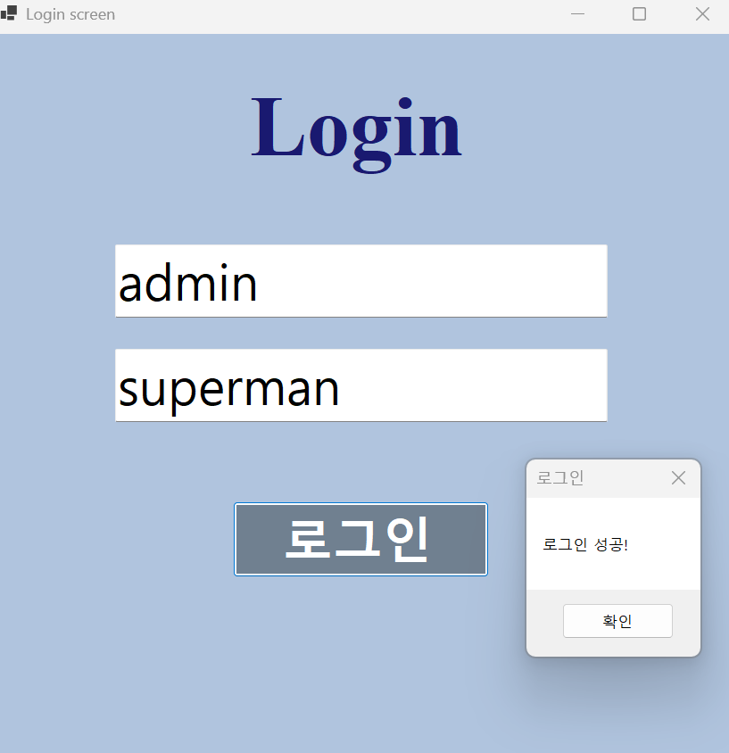

# (C# 코딩) 로그인 패스워드

## 개요

- 1줄 소개: 로그인 패스워드 입력 기능을 구현했습니다.

- 사용한 플랫폼:
 - C#, .NET Windows Forms, Visual Stdio, GitHub
- 사용한 컨트롤:
 - Label, TextBox, Button

- 사용한 기술과 구현한 기능:
- C#, windows Forms, 이벤트 기반 프로그래밍, 문자열 처리, UI 컨트롤
- 입력창 클릭 시 기존 문구 삭제 및 글자색 검정으로 변경
- 입력창 벗어날 때 입력값이 없으면 다시 기본 문구 표시 및 글자색 회색으로 변경

##실행 화면 (과제1)

- 과제 내용
- UI 구성
- Placeholder 표시
- 로그인 가능 여부 체크 기능
- 로그인 성공/실패 메시지 박스 보여주기

- 구현 내용과 기능 설명
- 입력창 클릭 시 기존 문구 삭제 및 글자색 검정으로 변경
- 입력창 벗어날 때 입력값이 없으면 다시 기본 문구 표시 및 글자색 회색으로 변경
- 비밀번호 마스킹 처리, 입력창이 비어있을 경우 마스킹 해제
- 미리 설정된 ID, PW와 일치하면 "로그인 성공" 메시지 출력
- 미리 설정된 ID, PW와 일치하지 않으면 "로그인 실패~" 메시지 출력

